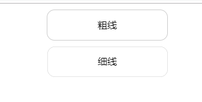

# 移动端小于1px的边框

在网页中边框的最小宽度就是1px, 即使设置边框宽度为0.5px, 展示出来的宽度也会是1px。尽管在网页中1px已经是很细, 但在移动端仍然很粗。因此需要方法将其变细



示例代码

```html
……
  <style>
    * {
      margin: 0;
      padding: 0;
    }
    .lines {
      width: 200px;
      margin: 0 auto;
      border: 1px solid #cccccc;
      height: 50px;
      line-height: 50px;
      text-align: center;
      border-radius: 13px;
      margin-top: 10px;

    }

    .hairlines {
        height: 50px;
        width: 200px;
        margin: 0 auto;
        line-height: 50px;
        border:none;
        text-align: center;
        position: relative;
        margin-top: 10px;
    }

    .hairlines::after{
      content: '';
      position: absolute;
      left: 0;
      top: 0;
      border: 1px solid #cccccc;
      border-radius: 26px;
      width: 200%;
      height: 200%;
      -webkit-transform: scale(0.5);
      transform: scale(0.5);
      -webkit-transform-origin: left top;
      transform-origin: left top;
    }
  </style>
 ……
<div class="lines">粗线</div>
<div class="hairlines">细线</div>

```

使用after伪类添加跟在div后的元素, 并且通过宽度和高度扩张两倍, 再用transform：scale(0.5)缩小一半的方式, 回归到原来的宽度和高度, 边框也会跟随着缩小到原来的一半, 即0.5px。需注意的是div本身要是position: relative, after伪类后的position: absolute。而且 transform-origin: left top, 才能定位到左上方。

再贴出一个网上常搜的方式使得下边框小于1px

```html
 <style>
 .underline{
      height: 60px;
      line-height: 60px;
      padding-left: 10px;
      position: relative;
      font-size: 20px;
  }
  .underline::after{
      content: "";
      display: block;
      position: absolute;
      left: -50%;
      width: 200%;
      height: 1px;
      background: #ededed;
      -webkit-transform:scale(0.5);
  }
  </style>
  <div class="underline">下边框线</div>

```
